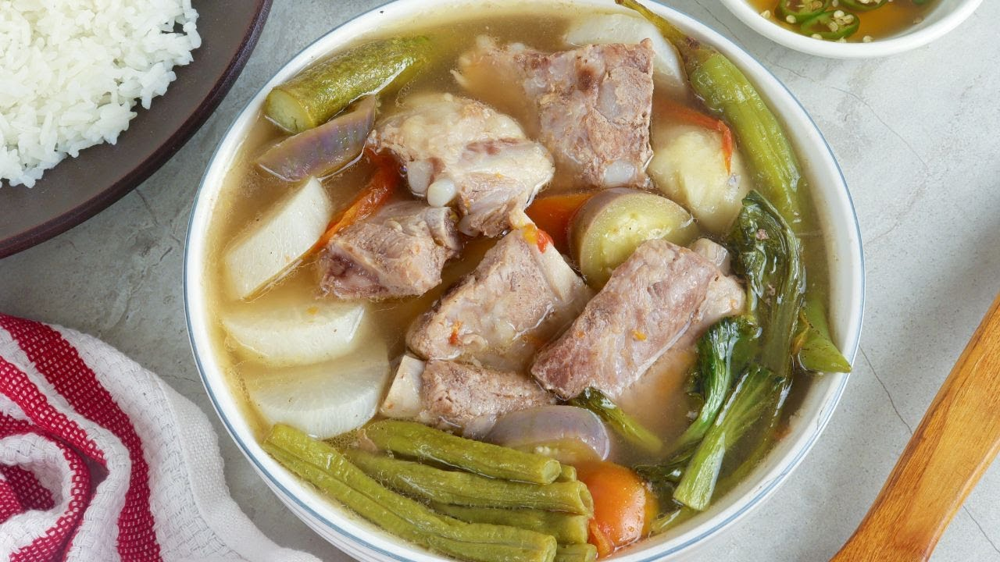

Among the many dishes that I have tasted in the Philippines, sinigang holds a very prominent place throughout my years of growth and development in the Philippines. As a young girl, I remember my apparent lack of appreciation for this tamarind based soup. Interestingly, my siblings took great liking to sinigang and would request to have it for lunch or dinner every now and then. However, I was never as enthusiastic as them when it came to having the dish for any meal in particular. Although it was not necessarily one that I would prefer eating, I would take a bite every now and then if it were served to me. I found the tanginess of the dish to be overpowering and would only ever look forward to the meat, shrimp or taro within the soup. However, this opinion changed as I entered high school and a newfound appreciation for the dish grew. 
The memories that I have with sinigang are vaguely similar to one another. The first distinction that I notice is the smell of the stew—one that is sour with a savory note from the tamarind and pork respectively. I would, most often, then hear the sound of a huge pot boiling on the stove together with the exhaust that keeps the smoke from traveling all over the apartment. Other times, the sound of chopping reaches my ears as whoever is cooking throws these ingredients into the pot. The next sense making itself known would be sight. I envision someone in the room standing under the warm light that engulfs the kitchen counter as they work their way through the various cooking materials. Walking into my house and seeing that there is someone at home with me at the same time becomes a different feeling altogether. As I enter the kitchen area, I feel the steam hitting my face as I open up the pot—curious as to what is inside even though I have had the dish countless times before. Finally, I taste the soup in all of its sour and tangy flavors. It holds balance from the different vegetables tossed in, as well as the tender pork slowly cooking in the broth. There is truly nothing like the experience I have had with eating sinigang on a rainy day. 
As mentioned, my relationship with the sour stew was always one that was rocky. I did not necessarily dislike the soup, but it was never one that I preferred. My perspective on this changed one afternoon when I was an incoming junior in high school. Back in the Philippines, I was involved in the softball league of my high school, as well as the national team. During the summer, my teammate invited me over to her residence to spend time with her after four hours of rigorous training on a hot and open field. As I had no other plans that day, I accepted her invitation. Although I did not expect to receive anything as a last-minute guest, she had settled me in her dining room and served me none other than sinigang for lunch. I remember feeling this sense of friendship grow into one that felt more familial even if we had not been close friends prior to this meal. Seeing how people go out of their way to cook something for me is one of the many heartwarming memories I have associated with sinigang. 
Presently, I live on O‘ahu—one of the many islands of Hawai‘i. Although there is a large community of Filipinos present on the island, I do not find myself eating or cooking Filipino dishes often. Luckily, my roommate who was born and raised in California always finds herself in the kitchen making all sorts of food ranging from Italian cuisine to Filipino meals. I distinctly remember coming back to my apartment on a rather gloomy night and receiving a text message about tasting the pot of soup on the stove. I travel to the kitchen and find that there is indeed a large pot of sinigang slowly cooking under the range hood. This act showed how care manifested itself through food—as most Asian households experience growing up. After going through a long day of school, work, and organizational meetings, seeing the familiar tamarind based soup brought a sense of home from the Philippines all the way to Honolulu. It was through sinigang that I was able to connect these two distinct memories from my life back in the Philippines and the one that I am currently living out in Hawai‘i.
